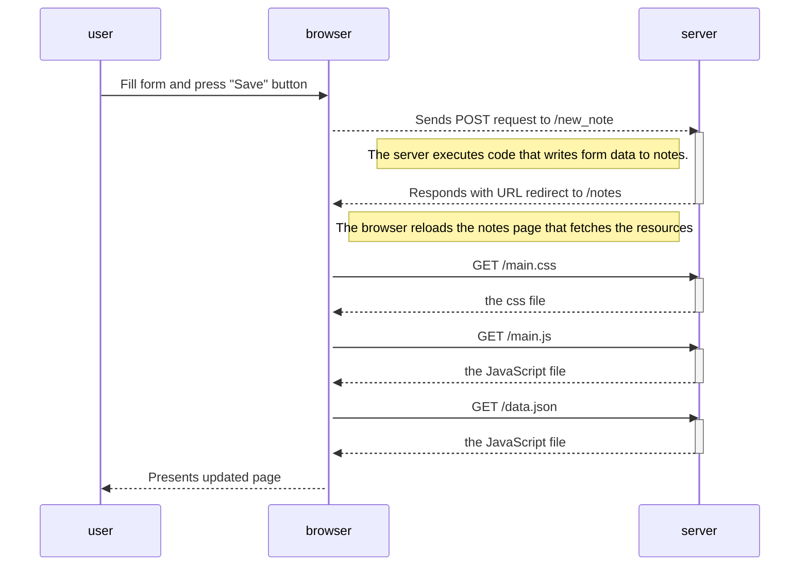

```mermaid
sequenceDiagram
    participant user
    participant browser
    participant server


    user->>browser: Fill form and press "Save" button
    activate browser
    browser-->>server: Sends POST request to /new_note
    activate server
    Note left of server: The server executes code that writes form data to notes.
    server-->>browser: Responds with URL redirect to /notes 
    deactivate server

    Note right of browser: The browser reloads the notes page that fetches the resources

    browser->>server: GET /main.css
    activate server
    server-->>browser: the css file
    deactivate server

    browser->>server: GET /main.js
    activate server
    server-->>browser: the JavaScript file
    deactivate server

    browser->>server: GET /data.json
    activate server
    server-->>browser: the JavaScript file
    deactivate server

    browser-->>user: Presents updated page


```