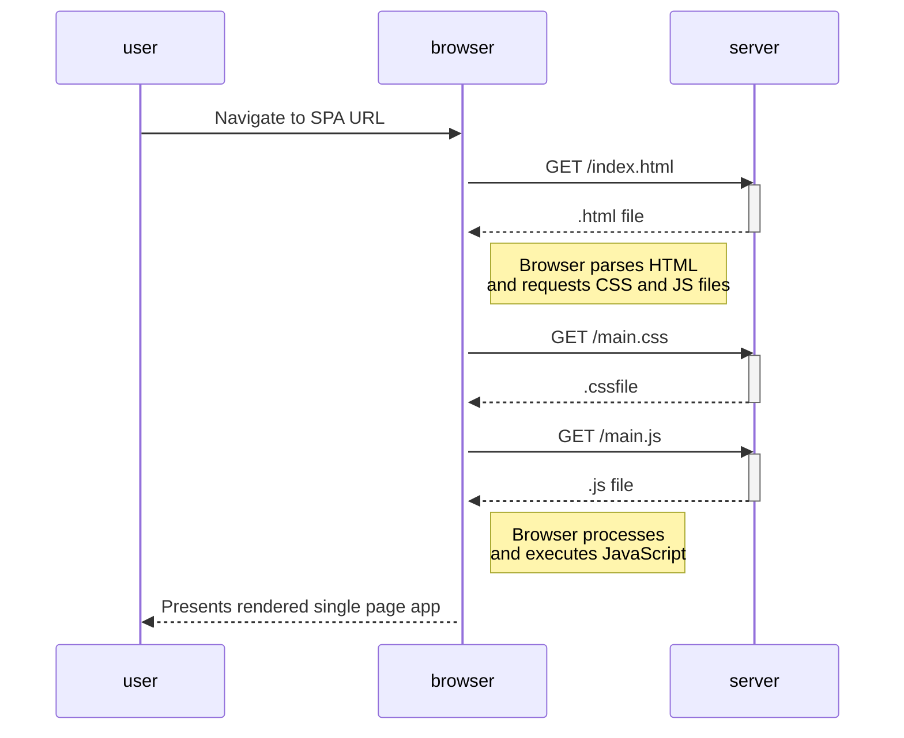

```mermaid
sequenceDiagram
    participant user
    participant browser
    participant server

    user->>browser: Navigate to SPA URL
    activate browser
    browser->>server: GET /index.html
    activate server
    server-->>browser: .html file
    deactivate server

    Note right of browser: Browser parses HTML <br> and requests CSS and JS files

    browser->>server: GET /main.css
    activate server
    server-->>browser: .cssfile
    deactivate server

    browser->>server: GET /main.js
    activate server
    server-->>browser: .js file
    deactivate server

    Note right of browser: Browser processes <br> and executes JavaScript

    browser-->>user: Presents rendered single page app

```