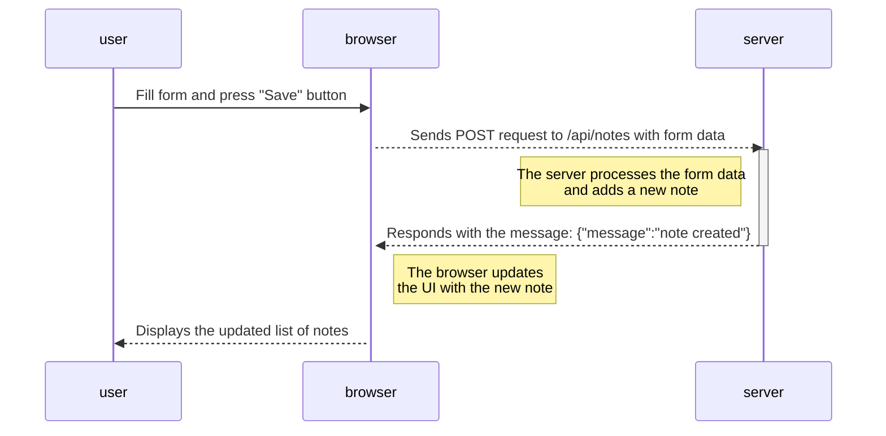

```mermaid
sequenceDiagram
    participant user
    participant browser
    participant server

    user->>browser: Fill form and press "Save" button
    activate browser
    browser-->>server: Sends POST request to /api/notes with form data
    activate server
    Note left of server: The server processes the form data <br> and adds a new note
    server-->>browser: Responds with the message: {"message":"note created"}
    deactivate server

    Note right of browser: The browser updates <br>the UI with the new note

    browser-->>user: Displays the updated list of notes
```